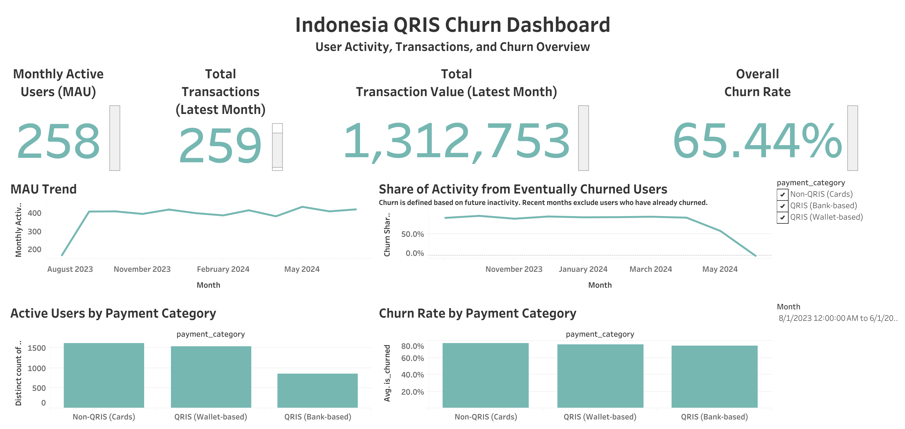

# Indonesia QRIS Payment Behavior & Churn Analysis

This repo contains an end-to-end analytics project that analyzes user behavior and churn patterns in a digital payment ecosystem, framed within the context of Indonesia’s QRIS (Quick Response Code Indonesian Standard) payment infrastructure.

Using transaction-level data, the analysis examines how different payment rails—QRIS-based payments versus non-QRIS card payments—relate to user engagement, transaction value, and behavioral churn.

This project is structured into two stages:
- **Python Analysis:** Exploratory analysis and churn modeling using transaction-level data.
- **Tableau Dashboard:** An interactive dashboard translating the same metrics into a stakeholder-facing BI tool.

---

## Business Context

QRIS is Indonesia’s unified QR code payment system, enabling payments across banks and e-wallet providers through a single standardized interface. In practice, QRIS payments can be initiated from:
- **Bank-based applications** (mobile banking)
- **Wallet-based applications** (e-wallet balances such as GoPay, OVO, DANA, etc.)

To reflect this ecosystem, raw payment methods in the dataset are recoded into three Indonesia-relevant categories:
- **QRIS (Bank-based)**
- **QRIS (Wallet-based)**
- **Non-QRIS (Cards)**

This recoding is used as an analytical proxy to compare behavioral patterns across payment types.

---

## Dataset

- Unit of analysis: **1 row = 1 transaction**
- Key fields used:
  - `transaction_date`
  - `user_id`
  - `transaction_id`
  - `product_amount`
  - `payment_category`
  - `is_churned` (0/1)

---

## Churn Definition

This project uses **behavioral churn** (no explicit cancellation event).

A user is labeled **churned** if they have **no transactions in the final 90 days of the observation window**.

> Note: This makes the churn KPI an **overall/lifetime churn** metric (not monthly subscription churn).

---

## Key Questions

- Do churn rates differ between QRIS-based payments and non-QRIS card payments?
- Is churn driven more by low engagement (frequency) or low transaction value?
- How do usage and churn dynamics evolve over time?

---

## Key Findings

- **Churn is primarily engagement-driven.**  
  Active users complete more transactions on average than churned users, while transaction values remain relatively similar across groups.

- **QRIS-based payments are slightly more “sticky.”**  
  Both bank-based and wallet-based QRIS payments exhibit marginally lower churn rates compared to non-QRIS card payments.

- **Most users are low-frequency users.**  
  The median number of transactions per user is one, indicating that retention improvements are likely driven by small increases in repeat usage rather than the emergence of high-frequency “power users.”

- **Usage patterns are stable over time.**  
  Monthly activity and churn share show limited volatility, suggesting churn reflects ongoing behavioral patterns rather than short-term shocks.

---

## Tableau Dashboard

The dashboard answers the core business question:

**“How is the payment ecosystem performing, and where is churn risk coming from?”**

### KPI Overview
- Monthly Active Users (Latest Month)
- Total Transactions (Latest Month)
- Total Transaction Value (Latest Month)
- Overall Churn Rate (Lifetime)

### Trends
- Monthly Active Users (MAU) trend (complete months only)
- Churn share trend (share of activity coming from users who eventually churn)

### Breakdowns
- Active users by payment category
- Churn rate by payment category

### Churn Interpretation Note

Churn is defined based on future inactivity. As a result, recent months may show lower churn share because users who have already churned no longer generate transactions. This behavior is expected and reflects the limitations of transaction-based churn inference.

**Dashboard Preview:**

---

## Metric Definitions (Tableau)

- **Total Transactions:** `COUNT([transaction_id])`
- **Total Value:** `SUM([product_amount_num])`
- **Active Users:** `COUNTD([user_id])`
- **Overall Churn Rate:** `AVG([is_churned])`

Monthly:
- **Month:** `DATETRUNC('month', [transaction_date])`
- **MAU:** `COUNTD([user_id])` by Month
- **Churn Share:** `AVG([is_churned])` by Month

---

## Methods

- Transaction-level exploratory data analysis using **pandas** and **matplotlib**
- Feature engineering to map generic payment rails into QRIS-based categories
- Behavioral churn modeling using a 90-day inactivity window
- User-level engagement and transaction value analysis
- Monthly trend analysis for activity and churn dynamics (**Tableau**)

---

## Limitations & Assumptions

- The dataset is anonymized and synthetic/public, and does not represent proprietary data from specific Indonesian payment providers.
- Payment method recoding is intended to reflect Indonesia’s QRIS infrastructure for analytical purposes, not to measure exact market shares.
- Churn is inferred behaviorally based on inactivity; alternative churn windows may yield different absolute rates.
- Users may transact using multiple payment methods; simplified user-level aggregation is applied where necessary.

---

## Repository Structure

indonesia-qris-churn/
├── analysis.ipynb                
├── README.md
├── data/
│   ├── raw/
│   │   └── digital_wallet_transactions.csv
│   └── processed/
│       └── dashboard_data.csv     
├── dashboard/
│   ├── indonesia_qris_churn.twbx    
│   └── screenshots/
│       └── dashboard.png

---

## Next Steps

Potential extensions of this project include:
- Cohort-based retention analysis in Python
- Monthly churn modeling using cohort definitions
- Deeper segmentation by merchant category
- Integration with live data sources for automated dashboard refresh

---

**Author:** Laksa Fadhil Yansen  
Data Analysis | Modeling | Visualization
